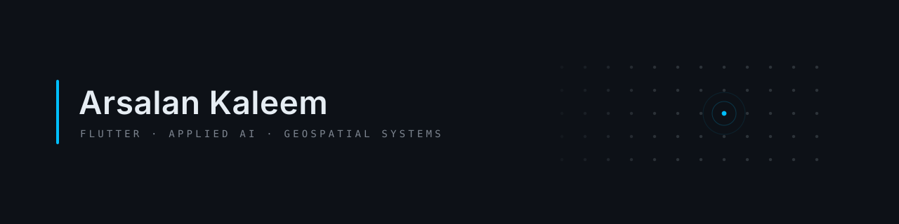

<!-- HERO BANNER -->

  <picture>
    <source media="(prefers-color-scheme: dark)" srcset="./assets/banner-dark.svg" />
    <source media="(prefers-color-scheme: light)" srcset="./assets/banner-light.svg" />
    
  </picture>

  <b>Software Engineer</b> — Flutter · Applied AI · Geospatial Systems

  
  
  
  

  <code>Karachi, Pakistan</code>

  

---

### ▍ About

I design and build production-grade software across **cross-platform application engineering**, **applied AI**, and **geospatial analytics**. My focus is taking high-friction, unglamorous problems—like NP-hard academic scheduling or village-level water access quantification—and building deterministic, scalable systems to solve them.

* **Architecture First:** Layered separation, immutable state, testable boundaries (Riverpod, Clean Architecture).
* **Grounded AI:** Determinism at the core, intelligence at the edges. Using RAG, agentic workflows, and structured tool-calling over raw LLM outputs.
* **Offline & Multi-Target:** Offline-first state persistence (Hive/Dio caching) targeting Web, Android, iOS, Windows, macOS, and Linux from a single Dart codebase.

---

### ▍ Tech Stack

* **Languages & Frameworks:** Dart, Flutter, Python, FastAPI, TypeScript
* **State & Architecture:** Riverpod, Freezed, GoRouter, Clean Architecture
* **AI & Data Pipelines:** Agentic Workflows, RAG, Gemini API, Parallel Agents, Pandas, NumPy
* **GIS & Remote Sensing:** Google Earth Engine, GeoPandas, QGIS, Sentinel-2 Analysis
* **Backend & DevOps:** Firebase, LiveKit (WebRTC), Docker, REST & GraphQL APIs, GitHub Actions, CI/CD

---

### ▍ Featured Projects

#### [forge-os](https://github.com/ArsalanKaleem/forge-os) — AI-Driven Open Source Onboarding

* **Problem:** Open source onboarding fails at issue discovery due to high filtering friction on GitHub.
* **Solution:** A multi-target Flutter companion app integrating GitHub REST/GraphQL APIs with Gemini guidance to surface beginner-friendly issues with codebase orientation and suggested approaches.
* **Tech:** `Flutter` `Riverpod` `GoRouter` `Dio` `Hive` `Gemini API`

#### TEMPUS — Automated University Timetabling *(Private Repository / University Project)*

* **Problem:** University scheduling is an NP-hard problem taking weeks of manual coordination.
* **Solution:** Formalized timetable generation into a Constraint Satisfaction Problem (CSP) solver utilizing constraint propagation and backtracking search to produce zero-conflict schedules in minutes.
* **Tech:** `Flutter` `Dart` `CSP Solver` `Firebase` `Riverpod`

#### [Sindh-Water-Access-index-SWAI-](https://github.com/ArsalanKaleem/Sindh-Water-Access-index-SWAI-) — Geospatial Intelligence for Water Access

* **Problem:** Lack of granular, village-level data on drinking water accessibility in Sindh, Pakistan.
* **Solution:** Research-grade geospatial pipeline combining Sentinel-2 satellite imagery, Google Earth Engine, and GeoPandas distance-decay modeling across 5,159 settlements, validated against government datasets (UN SDG 6 alignment).
* **Tech:** `Python` `Google Earth Engine` `GeoPandas` `QGIS` `Remote Sensing`

#### [Rural-Healthcare-Accessibility-Index--RHAI-](https://github.com/ArsalanKaleem/Rural-Healthcare-Accessibility-Index--RHAI-) — Geospatial Healthcare Analytics

* **Problem:** Measuring physical healthcare access gaps in rural underserved regions.
* **Solution:** Spatial accessibility index modeling facility reachability, travel boundaries, and population coverage gaps to support evidence-based public health interventions.
* **Tech:** `Python` `GeoPandas` `Spatial Analysis` `Healthcare GIS`

#### [Aestimo](https://github.com/ArsalanKaleem/Aestimo) — AI Career Copilot & Resume Intelligence

* **Problem:** Candidate resumes fail automated screening (ATS) due to poor keyword alignment and ungrounded formatting.
* **Solution:** End-to-end career copilot providing ATS scoring, grounded resume rebuilds, cover letter drafting, and interview prep using retrieval-grounded AI chat.
* **Tech:** `Flutter` `Google Gemini` `Firebase` `RAG` `Material Design`

#### [Documentium](https://github.com/ArsalanKaleem/Documentium) — Parallel AI Documentation Generator

* **Problem:** Technical documentation becomes outdated as codebases evolve rapidly.
* **Solution:** Multi-provider documentation generator orchestrating parallel AI agents to convert source code into structured API references and architectural overviews.
* **Tech:** `Flutter` `Dart` `Parallel AI Agents` `Multi-Provider LLM` `REST API`

#### [F1-Vision](https://github.com/ArsalanKaleem/F1-Vision) — Real-Time Motorsport Telemetry Dashboard

* **Problem:** Live telemetry analysis tools are typically proprietary and locked behind complex desktop interfaces.
* **Solution:** High-frequency live F1 dashboard displaying telemetry gauges, race control leaderboards, and season analytics powered by OpenF1 and Jolpica APIs.
* **Tech:** `Flutter` `Dart` `Telemetry` `Real-Time Data` `Firebase Auth`

#### [simul-watch-together-app](https://github.com/ArsalanKaleem/simul-watch-together-app) — Synchronized Media & Communication Platform

* **Problem:** Web-based co-watching platforms lack low-latency sync combined with integrated real-time video/audio chat.
* **Solution:** Room-based platform allowing users to watch YouTube in sync, video chat, screen share, and play Connect 4 in real-time.
* **Tech:** `Flutter` `Firebase` `LiveKit` `WebRTC` `Real-Time Sync`

---

### ▍ Research & Technical Writing

* **Geospatial & SDG 6:** Quantifying drinking water accessibility across 5,159 settlements using remote sensing and spatial statistics.
* **Constraint Solvers:** Formalizing institutional scheduling constraints into deterministic graph algorithms.
* **System Design:** Production Riverpod architecture, multi-platform state isolation, and offline-first data sync.

---

  

