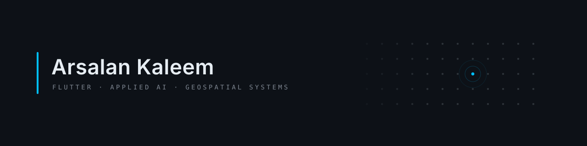

  

  <h1>Arsalan Kaleem</h1>
  <h3>Full-Stack Engineer • Flutter • Python • AI Safety • Geospatial Research</h3>
  

    <a href="https://arsalankaleem.github.io/portfolio/">Portfolio</a>
    ·
    <a href="https://linkedin.com/in/arsalankaleem">LinkedIn</a>
    ·
    <a href="mailto:arsalanabbasi.here@gmail.com">Email</a>
    ·
    <a href="https://github.com/ArsalanKaleem">GitHub</a>
  

  

    
     
    
  

 

## About

I build **production-grade systems and research tools** at the intersection of **software engineering, AI, security, and geospatial science**. My work ranges from cross-platform Flutter applications and real-time infrastructure to empirical audits of AI behavior and reproducible accessibility research.

I care about engineering that balances:

- **Architectural rigor** — clean, maintainable, testable code
- **Real-world impact** — tools that solve genuine problems
- **Evidence-driven results** — transparent methods, controls, and reproducible analysis
- **Honest evaluation** — reporting where systems work, where they fail, and what the data cannot establish

<table>
  <tr>
    <td align="center" width="50%">
      <strong>Frontend & Mobile</strong> 
      Flutter · Dart · HTML/CSS · JavaScript · Riverpod · GSAP
    </td>
    <td align="center" width="50%">
      <strong>Backend & AI</strong> 
      Python · FastAPI · LLM Agents · RAG · Gemini · PyTorch
    </td>
  </tr>
  <tr>
    <td align="center" width="50%">
      <strong>AI Safety & Security</strong> 
      Unlearning audits · Prompt-injection detection · Causal evaluation · Conformal calibration
    </td>
    <td align="center" width="50%">
      <strong>Geospatial & Data</strong> 
      Earth Engine · GeoPandas · OSMnx · QGIS · Spatial Analysis · Network Routing
    </td>
  </tr>
</table>

 

## What I Do

- **Ship multi-platform systems** — Flutter apps for Web, iOS, Android, Windows, and macOS with real-time backends and complex state management
- **Build AI-enabled infrastructure** — multi-agent systems, LLM evaluation frameworks, RAG pipelines, and intelligent automation
- **Study AI reliability and security** — testing whether apparent model capabilities survive proper controls and detecting indirect prompt injection before tool execution
- **Conduct geospatial research** — accessibility analysis, remote sensing, infrastructure mapping, and decision-support systems
- **Engineer for reproducibility** — preregistration, audit trails, deterministic pipelines, explicit limitations, and research outputs that others can verify

 

## Featured Projects

### 🛡️ AI Safety, Reliability & Security

| Project | Description | Tech |
|---------|-------------|------|
| [**TraceWarden**](https://github.com/ArsalanKaleem/tracewarden) | Pre-dispatch detection and localization of indirect prompt injection in LLM agent tool calls. Combines provenance/taint-style features, goal anchoring, causal signals, and conformal calibration. | Python, PyTorch, AgentDojo, Gradio, ONNX |
| [**Unlearning Audit**](https://github.com/ArsalanKaleem/unlearning-audit) | An empirical audit of whether LLM unlearning removes knowledge or merely suppresses its expression, using never-taught controls that standard diagnostics omit. | Python, PyTorch, scikit-learn, Statistical Testing |
| [**Documentum**](https://github.com/ArsalanKaleem/Documentum) | Multi-LLM documentation generator with parallel AI agents and Flutter Desktop/Web interfaces. | Dart, Python, LLM Agents, FastAPI |
| [**Website Security Assessment**](https://github.com/ArsalanKaleem/website-security-assessment) | Non-destructive security audits covering TLS/SSL, HTTP headers, DNS, port scanning, and CVE correlation. | Python, Security Tooling |

### 🚀 Full-Stack & Systems

| Project | Description | Tech |
|---------|-------------|------|
| [**Nuntius**](https://github.com/ArsalanKaleem/Nuntius) | WhatsApp chat analytics with interactive Wrapped stories, monthly archives, and PDF reports. Handles 250k+ messages on-device. | Flutter, Dart |
| [**SIMUL**](https://github.com/ArsalanKaleem/simul-watch-together-app) | Synchronized YouTube viewing, video chat, screen sharing with audio, and Connect 4 gaming in a real-time experience. | Flutter, Firebase, LiveKit |
| [**F1-Vision**](https://github.com/ArsalanKaleem/F1-Vision) | Cinematic F1 dashboard with live telemetry gauges, race-control leaderboard, and season-wide analytics. | Flutter, Dart, OpenF1 API |
| [**Portfolio**](https://github.com/ArsalanKaleem/portfolio) | Immersive, scroll-driven developer portfolio with GSAP animations and micro-interactions. | HTML, CSS, JavaScript, GSAP |
| [**Aestimo**](https://github.com/ArsalanKaleem/Aestimo) | AI career copilot for resume insights, ATS optimization, cover letters, interview preparation, and grounded chat. | Flutter, Dart, Gemini |
| [**ForgeOS**](https://github.com/ArsalanKaleem/forge-os) | AI-powered discovery of trending repositories and beginner-friendly GitHub issues with Gemini guidance. | Flutter, Dart, Gemini API |

### 🌍 Geospatial Research & Public Impact

| Project | Description | Tech |
|---------|-------------|------|
| [**RHAI** — Rural Healthcare Accessibility Index](https://github.com/ArsalanKaleem/Rural-Healthcare-Accessibility-Index--RHAI-) | Village-level travel time to rural public primary care across Sindh, Pakistan, computed over real road networks. The study shows that open facility data can overstate population-weighted travel time by about 2× and the population more than 30 minutes from care by about 10×. | Python, OSMnx, NetworkX, GeoPandas |
| [**SWAI** — Sindh Water Access Index](https://github.com/ArsalanKaleem/Sindh-Water-Access-index-SWAI-) | Village-level drinking-water accessibility analysis across 5,159 settlements using open geospatial data. | Python, Earth Engine, Geospatial Analysis |
| [**Flood Recovery Sindh**](https://github.com/ArsalanKaleem/flood-recovery-sindh) | Disaster impact assessment and recovery-planning infrastructure. | Python, Geospatial Data |
| [**Civic Ping Pakistan**](https://github.com/ArsalanKaleem/Civic-ping-pakistan) | Community infrastructure monitoring and civic engagement tool. | Dart, Flutter |

### 🛠️ Earlier Projects & Learning

| Project | Description | Tech |
|---------|-------------|------|
| [**ARKA**](https://github.com/ArsalanKaleem/ARKA) | Systems and research toolkit. | Python |
| [**Movix**](https://github.com/ArsalanKaleem/movix) | Movie discovery and management platform. | Web Technology |
| [**Accordion**](https://github.com/ArsalanKaleem/Accordion) | Interactive accordion UI component. | HTML, CSS, JavaScript |
| [**AgWeb**](https://github.com/ArsalanKaleem/AgWeb) | Web project. | CSS, HTML |

 

## Research Interests

I am particularly focused on:

- **AI reliability & evaluation** — realistic assessment of LLM capabilities, limitations, and misleading diagnostics
- **AI security** — indirect prompt injection, tool-use security, provenance tracking, and practical defenses
- **Machine unlearning** — distinguishing internal representation changes from output suppression with strong controls
- **Geospatial accessibility** — infrastructure-driven decision making and public health equity
- **Remote sensing & spatial analysis** — evidence-based planning and resource allocation
- **Constraint solving & optimization** — planning problems with real-world constraints
- **Reproducible research systems** — making computational research transparent, auditable, and usable

  
  
  
  
  
  

 

## Language & Tools Breakdown

- **Dart** — primary language for cross-platform Flutter apps across Web, Mobile, and Desktop
- **Python** — research, backend systems, data pipelines, AI infrastructure, and security tooling
- **HTML/CSS/JavaScript** — web frontends, animations, and interactive experiences
- **PyTorch & scientific Python** — model evaluation, statistical analysis, and reproducible experiments
- **C++** — systems programming and algorithms in educational projects

 

  <i>Building tools that turn research into reliable systems—and systems that solve real problems.</i>

